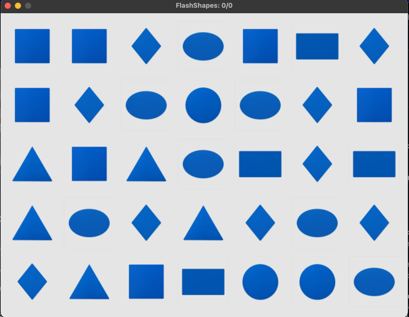

# Flash Shapes — Attention and Memory Trainer

**FlashShapes** is a game that develops visual perception, concentration, and short-term memory.  
Your task is to memorize the positions of shapes on the grid within a short time and correctly count the number of the
selected type.



---  

## How to Play

1. Set:
    - Display time for shapes (in milliseconds)
    - Grid size (number of columns and rows)
2. The game will show the **target**—the shape you need to count
3. Click **"Show Shapes"**
4. Try to remember how many target shapes are on the grid among others within the given time
5. Enter your answer
6. Get the result ✅ or ❌
7. Repeat to train your attention and memory!

---  

## 🧠 Why It’s Useful

- Improves concentration and short-term memory
- Trains attentiveness and spatial perception

---  

## Features

- Pure `pygame` implementation, no third-party GUI frameworks
- Customizable grid: adjustable rows and columns
- Adjustable display time
- Support for custom shape images
- Real-time score display in the window title

---  

## Dependencies

- `Python` v.3.12+
- `pygame` v.2.6+

Manual installation:

```bash  
pip install pygame  
```  

---  

## If you find this useful...

...give it a star, fork it, or mention it in your next data project!

## Author

**Anatoly Dudko**  
[GitHub @aDudko](https://github.com/aDudko) • [LinkedIn](https://www.linkedin.com/in/dudko-anatol/)